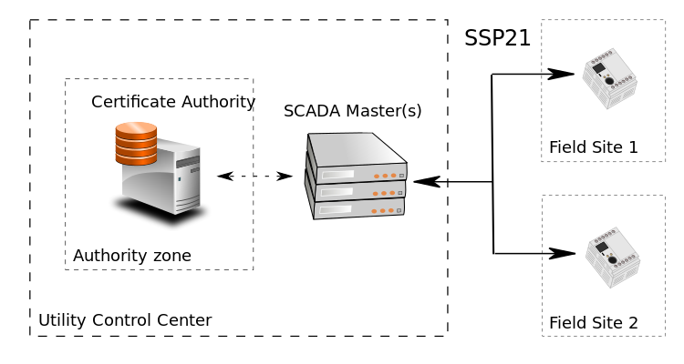
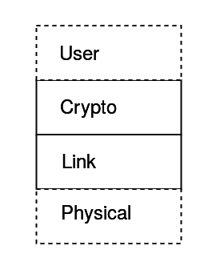

# Introduction

Secure SCADA Protocol (SSP) is cryptographic wrapper designed to secure point-to-multipoint serial protocols, or to act 
as a security layer for new SCADA applications. It is intended to fill a gap where existing technologies like TLS are 
not applicable, or require too much processing power or bandwidth. It can be used as a protocol agnostic bump in the 
wire (BitW) at initiator endpoints or as a bump in the stack (BitS) on the master or the outstation. No provision is 
made for retrofitting masters with a BitW as we assume that masters can be much more easily upgraded than outstations.

# Requirements

The following requirements guided the design of the specification and the selection of appropriate companion standards.

## Basis of trust - "Utility PKI"

All trust in the system is based on a Public Key Infrastructure (PKI) wholly controlled by the asset owner. A more 
efficient certificate format than [x509](https://tools.ietf.org/html/rfc5280) will be utilized to reduce bandwidth 
consumption for low bit rate serial networks. Asymmetric key algorithms for key derivation and/or signing will use 
primitives substantially more efficient than RSA encryption.

## Asymmetric Certificate Revocation

Master certificates (certificates that identify masters to outstations), will support a fast expiration scheme in
addition to  explicit revocation. This works well in an operational environment where the utility has a reliable and 
isolated IP network between an online authority and multiple master stations. An intermediate authority private key can
be used to periodically renew master certificates. Using certificate revocation lists (CRLs) with outstations may be 
undesirable as outstations may not be able to reach them on a serial channel, and masters would have to push revocation
notifications down to each endpoint and ensure that they arrive. Outstations would then have to persist these CRLs in
non-volatile memory.

This scheme requires that outstations have access to an out-of-band time synchronization mechanism such as GPS, local 
NTP via GPS in a substation, or WWVB. Alternatively, over TCP networks, outstations could check an online CRL.

Outstation certificates (certificates that identify outstations to masters) will be longer lived, and will be revoked 
using an online CRL accessible to the masters in the system over a traditional TCP network.

## Simplicity of implementation

The encodings, state machines, and other technical details of the protocol shall, above all else but without 
sacrificing security, endeavor to be as simple to implement as possible. Complexity, bells and whistles, and unneeded 
features inevitably lead to bugs both in specification and implementation.

A reference implementation shall be developed to inform the evolving design, and shall not be an afterthought. Too 
often standardization efforts spend too much time on paper, only to lead to designs that are difficult to implement 
correctly.

## Use only strong vetted cryptography

SSP21 shall only use algorithms that have received prolonged and intense scrutiny from the crypto community. This does 
not mean that all algorithms need to be NIST approved. Algorithms that are simpler to implement and/or have variations 
with provably constant-time implementations should be preferred.

## Extensible only to the extent necessary

* Endpoints shall be able to identify the protocols version to each other during key exchange.
* Must be secure against protocol downgrade attacks via a mechanism that fully authenticates the handshake.
* The protocol shall use security-suite specifications to allow new algorithms to be used in future versions, or to 
provide more than one option for when algorithms, inevitably, are compromised.
* The number of initial security suites will be limited to one or two, and will only support authentication.

## Authentication

All messages shall be authenticated. Each endpoint in the session shall be able to unambiguously determine that a 
session message comes from the other endpoint. The authentication mechanism shall automatically provide message 
integrity and protection from spoofing and MitM attacks.

This authentication will ensure that a particular SCADA master is talking to a particular outstation. In other words, 
it shall only secure the communication link and will not authenticate individual users or operators of the system. Role 
Based Access Control (RBAC) and auditing of users is best done at the platform level, and is outside the scope of 
SSP21. Individual SCADA vendors are free to use different technologies (such as Active Directory, RSA, LDAP, Kerberos, 
etc.) to manage users at the platform level.

Particular BitS implementations could potentially use some metadata in certificates to limit or constrain what is 
allowed during a particular communication session. How this metadata is used or configured to limit permissions for a 
particular protocol is outside the scope of SSP21<!-- RLC: This implies that the "lite" certificate format allows for 
extensions -->.

## Protection from replay

Both endpoints of the session shall be able to detect replayed session messages. Although the protocol needs to be 
secure from replay, it does not necessarily need to ensure that all messages are delivered in order, as SCADA protocols
like DNP3 automatically handle retries at a higher level. The protocol will support two modes: one that strictly
enforces packet order over (TCP) and a more tolerant mode that allows any new (non-replayed) packet to pass over serial
or UDP. 

## Session message time-to-live (TTL)

Since SSP21 is designed to protect control protocols with particular timing constraints, undesirable behavior could 
occur if an attacker held back a series of authenticated control messages and then replayed them in rapid succession. 
To eliminate this mode of attack, both parties record their own relative time-base during session establishment.
Session messages then include a timestamp in milliseconds since this common time point that indicates the last possible
moment when the packet should be accepted.

Implementations will have to make these timing parameters configurable so that they can be tuned for the latency of
particular networks. As relative clock drift can occur, sessions may need to be renegotiated more frequently or the
configurable validity window of session messages increased appropriately.

## Optional encryption

The secure operation of SCADA systems does not require confidentiality of session traffic under all, or even most, 
circumstances. Reasons to prefer unencrypted sessions include the ability to inspect traffic with IDS/IPS and denying a 
potentially opaque tunnel usable by an attacker.

Certain systems may exchange sensitive information and require session confidentiality. SSP21 shall use a security 
suite specification and encodings that allow for encrypted sessions in the future. The session key exchange mechanism 
shall support forward secrecy.

## Support bump in the wire retrofits

The outstation implementations of the protocol shall be capable of being deployed as a bump in the wire (BitW) or 
integrated into endpoints as a bump in the stack (BitS).  BitS integration is preferred, but it is understood that BitW 
implementations are necessary to retrofit legacy components during transitions.

Requiring a BitW implementation only for outstations and not masters simplifies requirements as the BitW needn’t be 
protocol-aware. It can be configured with the static addresses of the outstation and master, and ignore protocol 
messages addressed for other nodes. In BitW and BitS implementations, all cryptographic operations including key 
negotiation and authentication will occur at the bump.

## Support serial and IP

Supporting multi-drop serial means that frames must be addressed in some manner. SSP21 will use 16-bit addressing as 
this accommodates the addressing scheme used for common existing SCADA protocols. SSP21 will have its own delimiters or 
length fields, and will use some type of non-cryptographic error detection so that environmental noise is 
probabilistically filtered out at a level below cryptographic checks for deliberate tampering.

For some protocols, this new secure serial layer could act as a replacement for redundant functionality in existing 
protocols. For example, the DNP3 link-layer and transport function could be completely removed in BitS implementations 
and replaced with the SSP21 crypto and framing layers. SSP21 could also fully wrap the existing protocols, but removing 
redundancy in certain implementations could provide significant bandwidth savings.

<!--- RLC: While true, I think this may hinder adoption in that market, as it would mean that an SSP21-enhanced
protocol is no longer interoperable with the  original protocol, but devices will still need to implement the
original protocol. That means more code (two link layers for the same protocol), more testing, more complex
procurement, more complex deployment, ...At least in the beginning, I think we should not expect anything other
than BitW on the outstation end... -->

Out-of-band messages like session key establishment, heartbeats, etc. can only be initiated from the SCADA master side 
when it attempts to send a normal protocol message. This is because in half-duplex communications the wrapper cannot 
squelch a reply from a remote by inappropriately using the channel.

## Low overhead

Security is not a zero-cost protocol feature. Inevitably adding a security sub-layer will require more bandwidth, 
increase latency, and put a computational burden on endpoints. SSP21 will endeavor to minimize these overheads.

* **reduced latency** – BitS implementations have a significant advantage in this regard over BitW. HMAC hold back 
can double latencies in BitW integrations as the entire packet must be received and verified before the first payload 
byte can be emitted. Some tricks could be played with asymmetric baud rates to minimize this effect. MAC algorithms 
should be used for which hardware acceleration exists.

* **reduced bandwidth** – It is not uncommon for serial SCADA systems to operate at rates as low as 1200 bits per 
second. Cryptographic encodings need to be sensitive to tight polling margins. HMACs can be truncated 
(per [NIST guidelines](http://csrc.nist.gov/publications/nistpubs/800-107-rev1/sp800-107-rev1.pdf)) to reduce overhead. 
BitS integration may be able to remove redundant layers provided by both the SSP21 and the wrapped protocol.
An efficient certificate format that utilizes Elliptic Curve Cryptography (ECC) public keys will be used to reduce
certificate sizes.

# Utility PKI

While the primary aim of this specification is describe the protocol in sufficient detail that it can be faithfully 
implemented, it is important to describe the broader system in which the protocol is designed to operate.

{#fig:networkarchitecture}

SSP21 is designed to secure the communication link between one or more SCADA masters and some number of field sites as 
shown in figure @fig:networkarchitecture. It accomplishes this using a PKI wholly owned and controlled by the utility. 
Ideally, SCADA masters and field assets (RTUs, gateways, IEDs, etc.) generate a public / private key pair locally, 
never share the private key with another entity (human or machine), and can freely disseminate the public key for the 
purposes of certificate generation. The primary role of any PKI is to reduce the complexity of key management by 
requiring parties to only place their trust in a central signing authority. The identity of all other parties is then 
established via certification from this authority. To understand the attractiveness of such an architecture, it useful 
to compare it to a few alternatives.

## Alternative: Shared secrets

In this architecture, each communication link has a shared-secret that both parties possess prior to any 
communication occurring. Security is achieved in knowing that only the other end of the channel possesses the same key.
Typically the long-lived shared secret is used to establish and authenticate a session using Password Authenticated Key
Exchange (PAKE) or session keys are encrypted before transmission using something like AES key wrap.

In a typical SCADA point-to-multipoint scenario, best practice dictates that there be a unique symmetric key for each 
outstation (N), and the master would possess a copy of all N keys for the outstations with which it communicates. The 
primary advantage of such a system is conceptual simplicity, but the system is difficult to use at scale for several
reasons:

* If multiple masters are needed for redundancy purposes, the keys must be shared with each master increasing the attack 
surface and the risk of compromise, or the number of keys in the system must be doubled from N to 2N.

* This type of an architecture does a poor job of limiting access to sensitive key data. To commission a new field 
asset, the key must be entrusted to field personnel, possibly contractors.

* Compromise of a field asset always requires that the channel be rekeyed. Compromise of the master requires that the 
entire system be re-keyed.

## Alternative: Asymmetric keys without an authority

In this architecture, each communication node has an asymmetric public / private key pair. It is free to disseminate 
the public key, and each node must possess the public key for every other node with which it communicates. This 
architecture better addresses some of the concerns presented with the symmetric key only architecture, namely:

* Multiple masters can be commissioned without doubling the number of keys in the system, however, each outstation must 
possess the public key of each master with which it must communicate.

* Only the master's public key(s) need to be shared with commissioning personnel. Each outstation can also secure its 
private key, and only share the public key. This makes tampering from insiders slightly more difficult than in the 
symmetric only scheme.

A number of potential problems still remain:

* Compromise of a master still results in having to update the master's public key on each outstation.

* Installing or authorizing additional masters requires either sharing the master private key with the backup master, 
or installing an additional master public key on all outstations.

SSP21 is able to operate without an authority by using the pre-shared key mode.

## Small vs big systems

Small systems with a limited number of outstations may function perfectly well with either the symmetric or asymmetric 
key scenarios described above.

While SSP21 does not support symmetric pre-shared keys, it can operate in an authority-less mode by using what is 
commonly referred to as "self-signed certificates". This mode is no different than the asymmetric case described above, 
and requires each party have the public key of party with which it communicates. Larger systems can benefit from a full 
PKI where the downsides above can be truly problematic.

## The role of the authority

The authority in the system possesses a private asymmetric key that it uses to sign certificates.  Certificates consist 
of the following elements:

* A public asymmetric key
* Metadata associated with the public key (e.g. id, validity windows, serial numbers, etc)
* A digital signature over all other data calculated using the authority private key.

Creating and signing certificates is one of the primary roles of the authority.  In its simplest form, this might 
consist of some cryptographic command line tools on a properly isolated server with a private key and a set of humans 
with access to this server.  Such a basic system might work for small systems.

### Issuing outstation certificates

There are far more outstations in any given SCADA system than the number of masters. Such a statement might seem 
trivial, however, it is an important insight into how the process of enrollment needs to be streamlined for large 
systems. In such systems, the authority is envisioned to have a hardened web portal accessible from the corporate LAN. 
This level of access allows authorized personnel to reach the portal using cellular IP technologies and a VPN.

The web portal would likely be secured using a commodity TLS certificate and the users authenticated using strong 
passwords and a second factor like a security token. The authority itself would likely reside in the DMZ, thus proper 
procedures will need to be followed to provide this access. Prior to commissioning a new field asset, a privileged user 
would grant the user commissioning the field asset the permission to generate a certificate for the asset. Thus the 
authority would maintain a database of a few items:

* An editable set of field assets that will require enrollment.
* A means of authenticating users and roles/permissions. This information is likely to come from an external identity
management system.

The database will already be configured by the system administrator with all of the authorized metadata for each 
certificate in question. The only piece of information the person generating the outstation certificate needs to 
provide once properly logged in is the outstation public key. Outstation certificates will be very long lived, likely 
for the lifetime of the equipment. A cryptographic break in the algorithm underlying the certificate signature will 
require that a new certificate be installed, so this algorithm should be chosen prudently.

It's important to note that while the authority could be a standalone application with its own complete database of 
outstations, masters, and users, it might also leverage data available in other systems. For instance, an LDAP server 
or other enterprise identity system could be used to establish the identity and permissions of users <!--- rlc: This 
should be the default way of doing things. The alternative above could be proposed as an alternative (i.e. invert 
places with here) but the default suggestion should be for the authority to only manage devices. -->. The authority 
might also be capable of keeping its database of outstations in the system synchronized with a utility EMS.

Allowing system administrators to pre-configure which users can generate certificates for which outstations and 
providing access to this part of the authority through proper safeguards will substantially streamline the process of 
enrollment and reduce the extent to which adding security impacts operations. The portal approach also limits direct 
access to signing keys and provides a central point for creating an audit trail regarding certificate generation.

### Revoking outstation certificates

The master(s) will be capable of reaching a CRL on the authority and will be responsible for checking it at a 
reasonable interval. The compromise of a single outstation private key is small breach compared to other attack 
scenarios. Nevertheless, a mechanism must be in place to allow for revocation.

### Issuing master certificates

The recommended way to issue master certificates is machine-to-machine (M2M) communication directly from the master to 
the authority. The reason for this asymmetry is that on a serial network, there is no path for an outstation to reach a 
certificate revocation list (CRL), and thus a fast expiration scheme allows master certificates to be "revoked" by 
virtue of the fact that the authority can refuse to renew them. This expiration should happen on the timescale of hours 
and not days.

The compromise of a master private key is a significant security event, since that master may be authorized to control 
a significant amount of field equipment. There is no fast mechanism for informing outstations on a serial network that 
a master has been compromised, thus some other mitigation will be needed until the affected certificate expires 
naturally.

The communication link between the authority and the masters can be secured using a separate, more-traditional PKI. 
Since the number of masters in the system is low, it could even use pairs of self-signed certificates where the 
authority has the public key of every master it needs to authorize. This public key would be used to authenticate the 
certificate sign request for the certificate to be used to authenticate the master to the outstation.

Unlike the web portal link to the authority, this M2M link need only be authenticated since no user credentials or 
critical information will flow over it. TLS with NULL encryption and a strong authentication mechanism would be 
sufficient and would allow NSM tools to continuously inspect and monitor this traffic. <!--- rlc: While this is true, I 
see no reason to mention it if we assume the master has a fast internet connection and sufficient processing power to 
do the necessary encryption (which should normally be the case). -->

# The Link Layer

SSP21 specifies a two layer architecture for delivering secure data to the user layer. The link layer provides three
features: 

* **Framing** - A procedure is defined to identify a frame from a stream of bytes.
* **Addressing** - The frame contains source and destination addresses for the transmitter and receiver.
* **Error detection** - All of the header fields and payload are covered by a cyclic redundancy check (CRC). 

Since this functionality does not  have any cryptographic protections, it is designed with simplicity in mind and is
completely stateless.  The CRC is important at this layer to detect data corruption from random sources 
(EMF, cosmic rays, etc).  This check is intended to prevent randomly corrupted payloads from  reaching the cryptographic
layer. This prevents "tampering" false positives from occurring at the cryptographic layer which would require a 
completely different organizational response than occasional randomly corrupted frames.

```

[ start ][ destination ][ source ][ length ][ crc-h ][ payload ][ crc-p ]

```

The frames consist of the following fields. All multi-byte integer fields (including the CRCs) are encoded in little 
little format.

**destination** (2-bytes) - The destination field encodes the address of the intended recipient of the frame. Devices 
shall always set this field to the address of the intended recipient when transmitting. When receiving a frame, devices 
shall not do any further processing of frames with an unknown destination address.

**source** (2-bytes) - The source field encodes the address of the transmitting party. The usage of this field may 
depend on the application layer of wrapped protocol.

**length** (2-bytes) - Length of the message, including the header and CRC, in bytes.

**crc-h** (4-bytes) - A 32-bit CRC value calculated over the header (start, destination, source, and length fields). 
The CRC polynomial is described in detail in the next section.

**payload** (0 to 4092 bytes) - An opaque payload that is passed to the cryptographic layer. The length is determined by
the *length* field in the header. This length shall never exceed 4092 bytes.

**crc-p** (4-bytes) - A 32-bit CRC value calculated over the payload bytes.
 
## CRC Polynomial

The CRC polynomial for the SSP21 link frame was selected based on the Hamming distance (HD) offered by several
candidate polynomials at different payload lengths. Our candidates included the following polynomials:
  
| notation  | DNP3     | IEEE 802.3 | **Castagnoli** |  Koopman   |
|-----------|----------|------------|----------------|------------|
| msb first | 0x3d65   | 0x04c11db7 | 0xf4acfb13     | 0x32583499 |
| Koopman   | 0x9eb2   | 0x82608edb | 0xfa567d89     | 0x992c1a4c |

The polynomials provide the following maximum payload lengths (in bytes) at various Hamming distances:

| HD   |  DNP3   | IEEE 802.3 | Castagnoli |  Koopman  |
|------|---------|------------|------------|-----------|
| 8    |    0    |    11      |     34     |     16    |
| 7    |    0    |    21      |     34     |     16    |
| 6    |    16   |    33      |     4092   |     4092  |
| 5    |    16   |    371     |     4092   |     4092  |
| 4    |    16   |    11450   |     8187   |     8188  |

Four byte polynomials can provide significantly better error detection across longer payload lengths. The Koopman
and Castagnoli polynomials were discovered using exhaustive search techniques and have significantly longer
runs of HD = 6 protection than IEEE 802.3. We selected the Castagnoli polynomial because of slightly better HD=8 
coverage for very short frames. The error detection properties of this polynomial have also been independently verified
by at least two researchers.

The maximum HD=6 payload length of 4092 determines the bound for the maximum link layer frame size allowed by the 
standard.

{#fig:stack}

# Cryptographic Layer

The cryptographic layer is inspired by [Noise](http://noiseprotocol.org), a self-described framework for building 
cryptographic protocols. This specification picks from all the available options and modes within Noise to create a 
subset appropriate for wrapping ICS serial protocols. This specification is self-contained. Reading the Noise 
specification is not required to understand or implement SSP21.

Modifications to Noise include:

* A single handshake pattern is used, therefore the concept of handshake patterns have been removed entirely.
* Modifying Noise to support authentication only (handshake and session)
* Message identifiers to make session renegotiation possible on serial networks
* Masters can specify sets of cryptographic algorithms
* Selecting a specific handshake mode that will be used in all applications
* Definitions for handshake payload data including relative time bases and certificate formats
* Static public keys are always transmitted as part of a certificate

## Terminology

The key agreement handshake in SSP21 is a request-reply protocol, thus are two parties: an *initiator* and a 
*responder*. Normally, the initiator is expected to be the SCADA master, and the responder is expected to be an
outstation. It's perfectly possible, however, to flip this relationship in certain circumstances, and have the 
outstation initiate the key agreement. To preserve the generality of the specification the terms initiator and responder
are used in place of master and outstation.

## Algorithms

SSP21 uses a number of cryptographic algorithms. They are described here within the context of the functionality they 
provide. The initial SSP21 specification contains a minimal subset of algorithms, but the protocol is capable of 
extension.

The following notation will be used in algorithm pseudo-code:

* The **||** operator denotes the concatenation of two byte sequences.
* The **[b1, b2, .. bn]** syntax denotes a, possibly empty, byte sequence.

### Diffie-Hellman (DH) functions

SSP21 currently only supports Curve25519 for session key agreement. It is described in detail in [RFC 
7748](https://www.ietf.org/rfc/rfc7748.txt).

| DH Curve       | length (*DHLEN*)       |
| ---------------|------------------------|
| Curve22519     | 32                     |

All DH curves will support the following two algorithms with the key lengths specified above.

* GenerateKeyPair() - Generate a random public/private key pair.

* DH(private_key, public_key) - Given a local private key and remotely supplied public key, calculate bytes of 
length _DHLEN_.

<!--- RLC: Should perhaps mention, as in the RFC, to check for all zeroes. -->
<!--- JAC: Yes, definitely. Keeping these comments here as a reminder. -->

### Hash Functions

SSP21 currently only supports SHA256 described in 
[FIPS 190-4](http://csrc.nist.gov/publications/fips/fips180-4/fips-180-4.pdf). SHA512 and/or hash function from the
BLAKE family will likely be supported in the future. The hash function serves two roles:

* Maintain a hash of all data sent and received during the key negotiation sequence. This running hash is then 
incorporated into the authentication signatures and makes any tampering of handshake data detectable.

* Used as a sub-function of HMAC to produce authentication tags and derive session keys.

| Hash Function       | Hash Length (*HASHLEN*) |
| --------------------|-------------------------|
| SHA256              |  32                     |

### Hashed Message Authentication Code (HMAC)

HMAC provides an authentication tag given a shared key and an input message. It is described in
[RFC 2104](https://www.ietf.org/rfc/rfc2104.txt). Any hash algorithm described above can be used in conjunction with this
construct, and the corresponding HMAC function will produce a tag with the same length as the underlying hash function.

HMAC(key, message) - Calculate an authentication tag from an arbitrary length symmetric key and message bytes.

### Key Derivation Function (KDF)

SSP21 has extensible support for an abstract KDF used during the handshake process.

All KDFs take *salt* and *input_key_material* parameters and return two keys, each 32-bytes in length.

```
  KDF(salt, input_key_material) -> (key1, key2)
```

#### HKDF

The default KDF is HKDF defined in [RFC 5869](https://www.ietf.org/rfc/rfc5869.txt).

* *HKDF(salt, input_key_material)*: Calculates a pair of session keys based on input key material. 
    * Sets *temp_key* = *HMAC(salt, input_key_material)*.
    * Sets *key1* = *HMAC(temp_key, [0x01])*.
    * Sets *key2* = *HMAC(temp_key, key1 || [0x02])*.
    * Returns the pair of keys *(key1, key2)*.

**Note: ** If the output of the HMAC exceeds 32 bytes, the keys are truncated to left-most 32 bytes.
    
The pseudo code here offers the following simplifications from the generic construction in the RFC:
 
* Specialized to only two output keys
* The optional info parameter is a zero byte sequence
* Extract and expand steps are collapsed into a single function
  
### CSPRNG

A cryptographically secure pseudorandom number generator (CSPRNG) is required for the selection of static and ephemeral 
private keys. Any secure RNG will do, put implementers should err on the side of caution and prefer one from a proven 
library.

## Messages

Every message at the cryptographic layer begins with a one octet message type identifier. The remaining octets are 
interpreted according the defined structure of that type.

### Syntax

SSP21 uses a lightweight structural syntax to define the contents of messages
and to specify how the message shall be serialized. These definitions
are meant to precisely define the contents of a message, and allow implementations
to use code generation.

Groupings of fields are called Structs. Structs use the following syntax:

```
struct <struct-name> {
  <field1-name> : <field1-type>
  <field2-name> : <field2-type>
  ...
  <field3-name> : <field3-type>
}
```

*Messages* are special *Structs* whose first field is always a constant value of the *Function* enumeration.

```
message <message-name> {
  function : enum::Function::<function-name>
  <field1-name> : <field1-type>
  <field2-name> : <field2-type>
  ...
  <field3-name> : <field3-type>
}
```

The following primitive types are defined. All multi-byte integers are serialized in network byte order.

* **U8** - 8-bit (1-byte) unsigned integer.
* **U16** - 16-bit (2 byte) unsigned integer.
* **U32** - 32-bit (4 byte) unsigned integer.

The following example defines a struct that provides counts of various types of flowers:

```
struct Flowers {
  num_roses : U8
  num_violets : U16
  num_petunias : U32
}
```

The serialized size of a *Flowers* struct would always be 7 bytes 
(sizeof(U8) + sizeof(U16) + sizeof(U32)).

#### Enumerations

Single byte enumerations are defined with the following syntax:

```
enum <enum-name> {
  <name1> : <value1>
  <name2> : <value2>
  ...
  <nameN> : <valueN>
}
```

The following example defines an enumeration of 3 possible color values:

```
enum COLOR {
  RED : 0
  GREEN : 1
  BLUE : 2
}
```

Enumeration types can be referenced from within a *Struct* or *Message* definition using the following notation:

```
struct <struct-name> {
  <enum-field-name> : enum::<enum-name>
}
```

Using the COLOR example above we could define a *Struct* that represents the intensity of a single color:

```
struct Intensity {
  color : enum::COLOR
  value : U8
}
```

#### Bitfields

Bitfields are single-byte members of *Structs* or *Messages* that encode up to eight boolean values, one value for each
bit using the following syntax:

```
bitfield <bitfield-name> { "name top bit", "name top bit - 1",  ... "name bottom bit" }
```

Bitfields can have zero to eight member bits. The top bit (0x80) is always implicitly defined first in the list of bit
names. Unspecified bits shall always be encoded as zero.  Parsers shall fail parsing if any unspecified bit is set in
the input.

```
bitfield Flags { "flag1", "flag2", "flag3" }
```

The bitfield above with flag1 = true, flag2 = false, and flag3 = true would have a serialized representation of
0b10100000 (0xA0). An example of input that would fail a parsing for this bitfield is 0b10100010 (0XA2).


#### Sequences

*Sequences* are variable length lists of a particular type. There are two categories of sequences:

* **SeqOf[Byte]** - Denotes a sequence of bytes, like a key, signature, etc.
* **SeqOf[struct type]** - Denotes a sequence of a defined structure type.

##### Variable Length Count

When serialized, all sequence types are prefixed with a variable length count of objects up to 
2^32 - 1 (unsigned 32-bit integer). The number of bytes required to encode various values is summarized in the table below.

| num bytes | # value bits | max value  | encoding of max value             |
|-----------|--------------|------------|-----------------------------------|
|    1      |       7      | 127        |  [ 0xFF, 0x7F ]                   |
|    2      |       14     | 16383      |  [ 0xFF, 0x7F ]                   |
|    3      |       21     | 2097151    |  [ 0xFF, 0xFF, 0x7F ]             |
|    4      |       28     | 268435455  |  [ 0xFF, 0xFF, 0xFF, 0x7F ]       |
|    5      |       32     | 4294967295 |  [ 0xFF, 0xFF, 0xFF, 0xFF, 0x0F ] |

The following rules apply to decoding:

1) The value is read from the least significant bit to the most significant bit.
2) The top bit (0x80) of the current byte indicates if another byte follows.
3) The bottom 7 bits are incorporated by shifting the values into the number modulo 7
4) There is only one valid encoding for any number and that encoding must use the fewest bytes possible.
5) The value of the 5th byte may not exceed 0x0F.

##### Examples

An example of a struct containing a sequence of bytes:

```
struct ByteSequence {
  value : SeqOf[Byte]
}
```

Given the message definition above, the ByteSequence with value equal to {0xCA, 0xFE} would be encoded as:

```
[0x02, 0xCA, 0xFE]
```

An example of a struct containing a sequence of structs:

```
struct NumberPair {
  first : U8
  second : U8
}

struct Pairs {
  values : SeqOf[struct::NumberPair](max = 5)
}
```

Note that the count of NumberPair structures limited to 5.

Suppose that we wish to encode the following sequence of number pairs:

```
{ {0x07, 0x08}, {0x08, 0x09}, {0x0A, 0xCC} }
```

The serialized Pairs message would be encoded as:

```
[0x03, 0x07, 0x08, 0x08, 0x09, 0x0A, 0xCC]
```

The first value of `0x03` is the variable length and indicates that there are 3 NumberPair structs in the sequence. The encoded 
NumberPair structs directly follow this count of objects.

#### Constraints

Certain field types have optional or mandatory constraints placed on their contents. Constraints on a field are expressed
with the following notation:

```
<field-name> : <field-type>(<id-1> = <value-1>, ..., <id-N> = <value-N>)
```

Any field without the trailing constraint syntax (...) is implicitly defined to have no constraints.

For example, a sequence of bytes may have a *count* constraint that defines the required number of elements for the sequence.

```
struct SomeStruct {
  id : SeqOf[U8](count = 16)
}
```

Parsers should always enforce constraints internally and signal errors whenever a constraint has been violated.

The table defines the allowed constraints and the field types to which they apply.

| Field Type(s)        | Constraint ID | Value semantics             |   Mandatory     |
| ---------------------|---------------|-----------------------------|-----------------|
| SeqOf[U8]            | min           | minimum number of elements  |     no          |
| SeqOf[U8]            | max           | maximum number of elements  |     no          |
| SeqOf[U8]            | count         | required number of elements |     no          |
| SeqOf[struct::?]     | max           | maximum number of elements  |     yes         |


### Definitions

#### Enumerations

Common enumeration types that are used in one or more messages are defined here.

##### Function

SSP21 message definitions always begin with a fixed value of the *Function* enumeration. This fixed value allows a 
parser to determine the type of the message by inspecting the first byte of an opaque message delivered by the link 
layer. The correct message-specific parser can then be invoked.
      
```
enum Function {
    REQUEST_HANDSHAKE_BEGIN  : 0
    REPLY_HANDSHAKE_BEGIN    : 1
    REQUEST_HANDSHAKE_AUTH   : 2
    SESSION_DATA             : 3
}
```

##### Nonce Mode

The *Nonce Mode* enumeration specifies how the nonce (message counter) is verified to protect
packets from replay.

```
enum NonceMode {
    INCREMENT_LAST_RX : 0
    GREATER_THAN_LAST_RX : 1
}
```

* **INCREMENT_LAST_RX** - The receiver of a session message will verify that each received nonce is strictly 
equal to the last valid nonce plus one. This is the default mode and should always be used in session oriented 
environments like TCP that provide stream integrity and ordering guarantees.

* **GREATER_THAN_LAST_RX** - The receiver of a session message will verify that each received is greater the last 
valid nonce. This mode is intended to be used in session-less environments like serial or UDP and allows for loss 
of authenticated packets, but also relaxes security allowing a MitM to selectively drop messages from a session.
The protocol being protected by SSP21 is then responsible for retrying transmission in session-less environments.

##### DH Mode

The *DH Mode* enumeration specifies which Diffie-Hellman function will be used during the handshake to derive key
material.

```
enum DHMode {
    X25519 : 0
}
```

##### Handshake Hash

The *Handshake Hash* enumeration specifies which hash algorithm will be used during the handshake process to prevent
tampering.

```
enum HandshakeHash {
    SHA256 : 0
}
```

* **SHA256** - Use SHA256

##### Handshake KDF

The *Handshake KDF* enumeration specifies which KDF is used to derive session keys and intermediate keys.

```
enum HandshakeKDF {
    HKDF_SHA256 : 0
}
```

* **HKDF_SHA256** - Use HKDF where the HMAC is HMAC-SHA256

##### Session Mode

The *Session Mode* enumeration specifies the complete set of algorithms used to secure the session. 

```
enum SessionMode {
    HMAC-SHA256-16 : 0
}
```

* **HMAC-SHA256-16** - Cleartext user data with the authentication tag set to HMAC-SHA256 truncated to the leftmost 16 bytes.
 
##### Certificate Mode

The *Certificate Mode* enumeration specifies what type of certificate will be exchanged by both parties to authenticate
each other during the handshake.

```
enum CertificateMode {
    PRESHARED_KEYS : 0
}
```

* **PRESHARED_KEYS** - No certificates are exchanged. Parties use each others preshared public static DH keys to
authenticate. The *certificates* field in handshake messages will be left empty.

##### Handshake Error

The *Handshake Error* enumeration denotes an error condition that occurred during the handshake process.

```
enum HandshakeError {
    BAD_MESSAGE_FORMAT                : 0
    UNSUPPORTED_VERSION               : 1
    UNSUPPORTED_DH_MODE               : 2
    UNSUPPORTED_HANDSHAKE_HASH        : 3
    UNSUPPORTED_HANDSHAKE_KDF         : 4
    UNSUPPORTED_SESSION_MODE          : 5
    UNSUPPORTED_NONCE_MODE            : 6
    UNSUPPORTED_CERTIFICATE_MODE      : 7
    BAD_CERTIFICATE_FORMAT            : 8
    UNSUPPORTED_CERTIFICATE_FEATURE   : 9
    BAD_CERTIFICATE_CHAIN             : 10
    AUTHENTICATION_ERROR              : 11
    NO_PRIOR_HANDSHAKE_BEGIN          : 12
    INTERNAL                          : 255
}
```

**Note: Implementations shall NEVER define custom error codes as this can allow implementation fingerprinting**

* **BAD_MESSAGE_FORMAT** - A received handshake message was malformed in some manner, i.e. it was improperly encoded.

* **UNSUPPORTED_VERSION** - The specified protocol version is not supported.

* **UNSUPPORTED_DH_MODE** - The requested Diffie-Hellman mode is not supported.
 
* **UNSUPPORTED_HANDSHAKE_HASH** - The requested hash algorithm is not supported.

* **UNSUPPORTED_HANDSHAKE_KDF** - The requested KDF algorithm is not supported.

* **UNSUPPORTED_SESSION_MODE** - The requested session security mode is not supported.

* **UNSUPPORTED_NONCE_MODE** - The requested session nonce mode is not supported.
 
* **UNSUPPORTED_CERTIFICATE_MODE** - The requested certificate mode is not supported.
 
* **BAD_CERTIFICATE_FORMAT** - One of the received certificates was improperly encoded.
 
* **UNSUPPORTED_CERTIFICATE_FEATURE** - The feature or specified algorithm in one of the certificates is not supported.

* **INTERNAL** - A error code for any unforeseen condition or implementation specific error. 

#### Handshake Messages

##### Request Handshake Begin

The initiator starts the process of establishing a new session by sending the *Request Handshake Begin* message. This
message contains a specification of all of the abstract algorithms to be used during the handshake and the session.

```
struct CryptoSpec {
   nonce_mode               : enum::NonceMode
   handshake_dh             : enum::DHMode
   handshake_hash           : enum::HandshakeHash
   handshake_kdf            : enum::HandshakeKDF
   session_mode             : enum::SessionMode
}
```

* **nonce_mode** - Identifies one of two modes for verifying messages against replay with differing
 security properties.

* **handshake_dh** - Specifies the DH algorithm to be used during the handshake, and implicitly determines 
the expected length of *ephemeral_public_key*.

* **handshake_hash** - Specifies which hash algorithm is used to prevent tampering of handshake data.

* **handshake_kdf** - Specifies which KDF is used for handshake key derivation.

* **session_mode** - Specifies the full set of algorithms used to secure the session.

The message also includes some constraints on the session to be established.

```
struct SessionConstraints {
   max_nonce : U16
   max_session_time : U32
}
```

* **max_nonce** - The maximum allowed value of either the transmit or receive nonce.
* **max_session_time** - The maximum allowed session time after which messages are no longer considered valid.

```
message RequestHandshakeBegin {
   function                 : enum::Function::REQUEST_HANDSHAKE_BEGIN
   version                  : U16
   spec                     : struct::CryptoSpec
   constraints              : struct::Constraints
   certificate_mode         : enum::CertificateMode
   ephemeral_public_key     : SeqOf[U8]
   certificates             : SeqOf[struct::CertificateEnvelope](max = 6)
}
```

* **version** - Identifies the version of SSP21 in use. Only new versions that introduce non-backward compatible 
changes to the specification which cannot be mitigated via configuration will increment this number. 

<!--- RLC: Consider using a scheme that would allow new features to be added without losing backward compatibility, and 
indicating it - e.g. a libtool-like versioning scheme -->

<!--- JAC: Yes, definitely. Will look into this. Will also make it explicit that adding new cipher suite modes won't
impact the version field ---->

* **spec** - Struct that specifies the various abstract algorithms to be used.

* **constraints** - Struct that specifies constraints on the session.

* **certificate_mode** - Specifies what type of certificates are being exchanged. If certificate_mode is equal to 
*PRESHARED_KEYS*, the *certificates* field shall be empty.

* **ephemeral_public_key** - An ephemeral public DH key with length corresponding to the associated length defined by
*handshake_dh_mode*.

* **certificates** - A possibly empty certificate chain that is interpreted according to the *certificate_mode* field.

##### Reply Handshake Begin

The responder replies to *Request Handshake Begin* by sending *Reply Handshake Begin*, unless an error occurs in which 
case it responds with *Reply Handshake Error*.

```
message ReplyHandshakeBegin {
   function : enum::Function::REPLY_HANDSHAKE_BEGIN
   ephemeral_public_key: SeqOf[U8]
   certificates: SeqOf[struct::CertificateEnvelope](max = 6)
}
```

* **ephemeral_public_key** - An ephemeral public DH key corresponding to the key type requested by the master.

* **certificates** - A possibly empty certificate chain that is interpreted according to the *certificate_mode* field
 transmitted by the master.

##### Reply Handshake Error

The outstation shall reply to a *Request Handshake Begin* with a *Reply Handshake Error* message if an error occurs.
This message is for debugging purposes only during commissioning and cannot be authenticated.

```
message ReplyHandshakeError {
   function : enum::Function::REPLY_HANDSHAKE_ERROR
   error : enum::HandshakeError
}
```

* **error** - An error code that enumerates possible error conditions that can occur during the handshake.

##### Session Data

Session data messages perform two functions:

* They authenticate the initial handshake when transmitted with nonce == 0.

* Any session message (including the initial authentication message) may also transfer authenticated (and possibly encrypted)
user data to the other party.

The message uses the following sub-fields:

```
struct AuthMetadata {
    nonce : U16
    valid_until_ms : U32
}
```

* **nonce** - An incrementing nonce that provides protection from replay of session messages.

* **valid_until_ms** - A relative millisecond timestamp since session initialization as defined in the section on key
negotiation.
 
```
message SessionData {
   function : enum::Function::SESSION_DATA
   metadata : struct::AuthMetadata
   user_data : SeqOf[U8]
   auth_tag : SeqOf[U8]
}
```

* **metadata** - The Metadata struct is covered by the authentication mechanism of the negotiated *Session Mode*.

* **user_data** - A blob of (possibly encrypted) user data.

* **auth_tag** - A tag used to authenticate the message.

## Key Agreement Handshake

Key agreement in SSP21 derives a common pair of symmetric keys that can be used to secure a session, and authenticates
both parties based on their long-term static DH keys. A successful handshake involves the exchange of the four messages
depicted in figure @fig:handshake.

{#fig:handshake}

The *Request Handshake Begin* and *Reply Handshake Begin* messages establish a new pair of session keys, but do not
authenticate the parties to each other. Any previously existing session remains valid until each party receives a
*Session Data* with nonce equal to zero and authenticated with the new session keys.

Initiators and responders may optionally transfer user data in these initial *SessionData* messages. This mechanism
effectively makes the handshake process a single round trip (1-RTT) request and response.  Certain implementations may
not wish to transfer user data until fully authenticated. Such implementations may send zero-payload *SessionData* messages
and remain wire-level compatible.

Initiators and responders shall differentiate between *SessionData* messages for an established session and initial 
authentication messages using the nonce. A *SessionData* for a previously authenticated session shall always use a nonce
greater than zero, whereas the handshake *SessionData* message shall always use a nonce equal to zero.

A previously valid session (keys, nonce values, start time, etc) shall remain active until a *SessionData* message 
is received and authenticated using the new session keys. Implementations may wish to implement this behavior using
two data structures, one for an *active* session and one for a *pending* session.

### Timing Considerations

In the procedure that follows, the initiator and responder establish a common relative time base so that future session
messages can be stamped with a time-to-live (TTL) value since the beginning of the session. This TTL value allows either
side of the connection to detect delays induced by a man-in-the-middle. This TTL is has its limitations. An attacker with
the ability to delay the handshake messages, can manipulate the common time base calculated by the initiator within the
configured response timeout for initiator.

All initiator implementations shall implement a response timeout to the handshake message(s). This timeout shall default
to 2 seconds. If a timeout occurs before receiving a valid response, the current handshake attempt shall be aborted.
This ensures that attackers cannot skew the common time base by more than this timeout parameter. Implementations should
enforce a relatively low maximum value for this parameter to ensure that users do not accidently deploy systems vulnerable
to large session time manipulations

### Procedure 

The following steps are performed during a successful handshake.

Notation:

* Both parties maintain a *handshake hash* denoted by the variable *h* which is HASH_LEN in length.
* The HASH() and HMAC() functions always refer to the hash function requested by the master in the *Request Handshake Begin* message
* NOW() returns the current value of a relative monotonic clock as a 64-bit unsigned count of milliseconds. 

DH keys in this section use the following abbreviations:

* re_vk - responder ephemeral private key
* re_pk - responder ephemeral public key
* rs_vk - responder static private key
* rs_pk - responder static public key
* ie_vk - initiator ephemeral private key
* ie_pv - initiator ephemeral public key
* is_vk - initiator static private key
* is_pk - initiator static public key

Symmetric keys in this this section use the following abbreviations:

* tx_sk - transmit session key
* rx_sk - receive session key

1. The initiator sends the *Request Handshake Begin* message to the responder containing an ephemeral public key, some
additional metadata, and an optional certificate chain.

    * The initiator sets *h* to the hash of the entire transmitted message:

        * *set h = HASH(message)*

    * The initiator records the time this request was transmitted for future use.
        
        * set *time_tx = NOW()*

2. The responder receives the *Request Handshake Begin* message.

    * The responder records the time this request was received for possible future use.

        * set *session_start_time = NOW()*

    * If using certificates, the responder validates that it trusts the initiator public key presented in the certificate chain.

    * The responder sets *h* equal to the hash of the entire received message:

        * *set h = HASH(message)*

    * The responder transmits a *Reply Handshake Begin* message containing its own ephemeral public DH key and
certificate chain as requested by the initiators's requested certificate mode.
 
    * The responder mixes the entire transmitted message into *h*.
        * *set h = HASH(ck || message)*
 
    * The responder then derives a pair of session keys and save saves them with the pending session.
        * *set dh1* = *DH(re_vk, ie_pk)*
        * *set dh2* = *DH(re_vk, is_pk)*
        * *set dh3* = *DH(rs_vk, ie_pk)*
        * *set (rx_sk, tx_sk) = KDF(ck, dh1 || dh2 || dh3)* 
 
3. The initiator receives the *Reply Handshake Begin* message.

    * The initiator then transmits a *Session Data* message using the specified *Session Mode*, the staged tx_sk key, 
any available user data, and nonce equal to 0. User data may be optionally included in the message.

    * The initiator starts the response timer.

4. The responder receives the *SessionData* message with n == 0.

    * The responder authenticates the message following the exact same procedure as normal session data, but uses
the session keys, session initialization time, and session mode for the pending session. The nonce verification is skipped.

    * The responder then transmits a *Session Data* message using the specified *Session Mode*, the staged tx_sk key, 
and nonce equal to 0. User data may be optionally included in the message.
        
    * The responder initializes the active session with (rx_sk, tx_sk, time_session_init, read, write, verify_nonce), replacing
any existing session.


5. The initiator receives the *Session Data* message with the nonce == 0.

    * Note: User data messages for any previous session (nonce > 0) shall still be processed normally from this state.

    * The initiator authenticates the Session Data message following the exact same procedure as normal session data, but uses
the session keys, session initialization time, and session mode for the pending session. The nonce verification is skipped.

    * The initiator initializes the active session with (rx_sk, tx_sk, time_session_init, read, write, verify_nonce), replacing
any existing session.
        
**Note:** See the section on session initialization for definitions of read, write, and verify_nonce functions.
        
### Security Properties

If any of the following properties do not hold, then initiator and responder will not agree on the same pair of session keys.

* If a MitM tampers with the contents of either the *Request Handshake Begin* message or the *Reply Handshake Begin*, 
the two parties will have different *h& values which will produce different keys when feed into the KDF.

* If either party does not possess the private DH keys corresponding to the ephemeral or static public keys 
transmitted, they will be unable to perform the correct DH calculations and will not be able to calculate the same keys 
using the KDF.

* A MitM cannot tamper with the common *time_session_init* by delaying messages by more than whatever timeout setting
 the initiator uses while waiting for replies from the responder. This ensures that the common time-point, in two separate
 relative time bases, is at least accurate to within this margin when the session is first initialized.
 
### Message Exchanges

The responder may signal an error after receiving a *Request Handshake Begin*:

{#fig:handshake_error}

## Sessions

### Initialization

Upon completion of a successfully authenticated handshake, the communication session is initialized 
(or possibly reinitialized) with the following arguments:

* **rx_sk** - A session key used to authenticate/decrypt received messages.
     
* **tx_sk** - A session key used to sign/encrypt transmitted messages.

* **time_session_init**  - The time the session was considered initialized in the local relative time base.

* **read** - A function corresponding to the specified *session_mode* used to process a received 
message's payload.
    * returns: 
        * Cleartext payload, or [] if an error occurs.
    * errors:
        * Signals an error if the message does not authenticate and/or decrypt properly.
        * Signals an error if input or output buffers do not meet required sizes.
    * arguments:
        * **key** - The session key used to perform the cryptographic operations.
        * **message** - A parsed *SessionData* message.

* **write** - A function corresponding to the specified *session_mode* used to prepare a transmitted 
message's payload.
    * returns:
        * The *user_data* to be transmitted with the outgoing message
        * the *auth_tag* to be transmitted with the outgoing message
    * errors:
        * Signals an error if input or output buffers do not meet required sizes.
    * arguments:
        * **key** - The session key used to perform the cryptographic operations.
        * **ad** - Additional data covered by the authentication tag (serialized form of the *SessionData::AuthMetadata* structure).
        * **user_data** - Cleartext user data bytes to be placed that might be encrypted.
  
* **verify_nonce** - A function used to verify the message nonce.
    * returns: 
        * A boolean value that is true if the new nonce is valid, and false otherwise.
    * arguments:
        * **last_nonce** - the last valid nonce, or zero for a newly initialized session.
        * **new_nonce** - the nonce from the current message.
  
The session shall also always maintain a few additional variables initialized internally:
    
* A 2-byte incrementing nonce (*n*) always initialized to zero, one for each session key.

* A configurable session termination timeout after which the session will no longer be considered valid. 
    
### Invalidation

Sessions will only become invalidated after one of the following conditions occurs:

* The transmit or receive nonce reaches the maximum value of 2^16 - 1.

* A configurable amount of time elapses. This session timeout shall default to 1 day and shall not be configurable
 to be greater than 30 days (the maximum session TTL of a message since initialization is ~49.7 days).
 
* A complete, authenticated handshake occurs reinitializing any prior existing session.

* In session oriented environments such as TCP, closing the underlying communication session will invalidate the SSP21
 cryptographic session.

Under no condition will malformed packets, unexpected messages, authentication failures, partial handshakes, or any 
other condition other than the ones listed above invalidate an existing session.

### Sending *Session Data*

The following procedure is followed to transmit a *Session Data* message:
  
* Ensure that the transmit nonce is not equal to the maximum value.
  
* Increment the transmit nonce by 1 and set this new value on the message.

* Set *valid_until_ms = NOW() + TTL*. 
 
* Set the message payload using the *write* function with which the session was initialized.

**Note:** The first transmitted session message from each party always has *n* = 1.

**Note:** See the TTL session for advice on how to set appropriate TTLs.

  
### Validating *Session Data*

The following procedure is followed to validate a received *Session Data* message:

* Verify the authenticity of the message using the *read* function with which the session was initialized. Upon
successful authentication, the cleartext payload is returned.

* Check that *valid_until_ms <= NOW()*.

* Check the nonce using the *verify_nonce* function with which the session was initialized.

* Set the current nonce equal to the value of the received nonce.

### Time-to-live

Each session message contains a time-to-live (TTL) parameter called *valid_until_ms*. This parameter is a count of
milliseconds since session initialization (as defined in the handshake section), after which, the receiving party
shall not accept an authenticated packet. This TTL prevents attackers from holding back a number of valid session 
messages and then replaying them in rapid succession.
  
While this feature provides an additional security guarantee absent in most IT security protocols, it must be configured
appropriately.

#### Clock drift

SSP21 Implementations are required to have an accurate relative clock with at least millisecond precision. This
standard does not require a particular minimum drift rate from real-time, however, hardware solutions deploying SSP21
should publish information about the maximum possible clock drift.

#### Setting the TTL

A strategy for setting the TTL in each transmitted message must take into account the following factors:
  
* *session key change interval* (**I**) - The longer the interval between session key changes, the more the relative clocks 
can drift apart.

* *maximum relative drift rate* (**R**) - The maximum possible drift rate expressed as a number greater than 1. For 
example, 1.0001 specifies that clocks can diverge by as much as 1/100th of 1% of the time elapsed.

* *initiator handshake response timeout* (**T**) - The longer the response timeout in the handshake, the greater potential 
mismatch in the session initialization time on the initiator and responder.

* *maximum network latency* (**L**) - The maximum amount of time it might take for a message to reach its destination under 
normal conditions.

A simple scheme would be to add a fixed value to the current session time as specified below. 

```
set current_session_time = session_init_time - NOW()
set max_drift = I * R
set TTL = current_session_time + max_drift + T + L
``` 

Schemes where the maximum drift dead-band is calculated dynamically based on the elapsed session time 
are also possible:

```
set current_session_time = session_init_time - NOW()
set max_drift = current_session_time * R
set TTL = current_session_time + max_drift + T + L
```

Regardless of the scheme chosen, implementations shall document whatever method they use for determining the TTL on 
transmitted packets.
 
#### Disabling Support

In applications that do not require a TTL, or where no accurate clock is available, implementations may optionally 
disable support for the TTL.

* In the receive direction, implementations may be configurable to ignore the received TTL entirely.
* In the transmit direction, implementations may be configurable to set the TTL to the maximum value of 2^32 - 1.

### Session Modes

The *session_mode* specified by the initiator determines the concrete *read* and *write* functions with which the 
session is initialized. In general, these functions fall into two general classes: truncated MAC based functions that
only provide authentication, and Authenticated Encryption with Associated Data (AEAD) algorithms that encrypt the 
payload and additionally authenticate both the payload and associated data in the message.

**Note:** Empty session messages are explicitly disallowed. Even authenticated empty messages should be treated and 
logged as an error, and never passed to user layer.

#### MAC Modes

<!-- There's some kind of weird formatting issue going on here with PDF -->

MAC session modes are based on some kind of MAC function, like a truncated HMAC. The write function of these modes can
be specified generically in terms of the MAC function.
   
```
write (key, ad, cleartext) -> (user_data, auth_tag) {
  set auth_tag = mac(key, ad || len(cleartext) || cleartext)
  return (cleartext, auth_tag)
}
```

The MAC is calculated over the concatenation of the following parameters:

* The serialized form of the additional data (ad).
* The length of the cleartext as an unsigned big endian 16-bit integer
* The cleartext itself

**Note:** Incorporating the length of the cleartext provides domain separation between *ad* and *cleartext*. This
futures proofs the specification in the event that *ad* is ever becomes a variable length structure.

The corresponding *read* function calculates the same MAC, verifies it using a constant-time comparison, and returns
the user_data field of the message as the cleartext.

## Certificates

SSP21 defines its own certificate format, the Industrial Certificate Format (ICF). It leverages
the definition and serialization rules used for messages within the cryptographic layer. The primary design
goals of the ICF include:

* Simplicity - The format and its encodings should be easy to understand and implement, where ASN.1 and its BER/DER
encodings are considered undesirably complex for this application.

* Efficiency/Size - The format shall be encodable in the low hundreds of bytes, rather than thousands of bytes to enable usage in 
bandwidth-limited applications.

* Relevant Metadata -  Only metadata relevant to ICS should be included. This explicitly means that much of the metadata
in x.509 related to domains/web is not pertinent here.

* Extensible in terms of algorithms - The format shall allow for migration to stronger digital signature algorithms (DSA) in the event of 
deprecation or break of any particular algorithm. 

* Extensible in terms of metadata - It is desirable in certain applications to sign and include additional metadata in the certificate
beyond what was defined in the original specification. An example of such an extension would be role based access control (RBAC) permissions for a
specific application protocol. The certificate format shall provide the ability to define extensions and define the required behavior when undefined
extensions are encountered.

### ICF Definition

The certificate format consists of three components:

* An outer envelope that contains unauthenticated metadata about the issuer, algorithm, and the signature value.

* Inner certificate data fully covered by specified the digital signature algorithm.

* Optional extensions contained within the certificate data itself.

#### Enumerations

The following enumerations are used within the various ICF message definitions.

##### PublicKeyType

This enumeration defines the type of the public key embedded in the certificate body.

```
enum PublicKeyType {
    Ed25519 : 0
    X25519  : 1
}
```

* **Ed25519** - The key is an Ed25519 DSA public key.
* **X25519** - The key is an x25519 Diffie-Hellman key.

#### Certificate Envelope

The certificate envelope is defined as follows:

```
message CertificateEnvelope {
    issuer_id        	:      SeqOf[U8](count = 16)
    signature           :      SeqOf[U8]
    certificate_body    :      SeqOf[U8]
}
```

* **issuer_id** - A 16-byte digest of the issuer's public key. This digest shall always be the leftmost 16 bytes
of the SHA-2 hash of the public key.

* **signature** - The value of the signature.

* **certificate_body** - The certificate body covered by the specified digital signature algorithm. This data shall
not be parsed until the authenticity is established by verifying the signature.

The following digital signature algorithms (DSA) are defined for usage with the ICF.

##### Security Discussion

Attackers may freely manipulate the *issuer_id* field with the following impacts:

* The verifying party would be unable to find the corresponding public key in which case the verification would immediately fail.

* The verifying party would apply the wrong public key to the DSA verification, in which case the verification would fail with similar
probability as attempting to brute force the signature value.

This *issuer_id* digest is not cryptographic in nature. It merely acts as convenient fixed-length digest for public keys of any length. It must
be well distributed against random inputs (i.e. public key values), but need not be cryptographically secure. A break in the underlying SHA-2
hash function does not require changing how the issuer_id is calculated.

The truncated hash used in the issuer id is not cryptographic in nature, and merely needs to be collision resistant against the possible
random public keys deployed in the system. It serves to provide a fixed size id for public keys of any size or length.

Attackers may also manipulate the *algorithm* field. Such a manipulation would fail either due to the length of the signature being incorrect, or an
signature value.

#### Certificate Body

The certificate body is defined as follows:

```
message CertificateBody {
    serial_number     :      U32
    valid_after       :      U64
    valid_before      :      U64
    signing_level     :      U8(max = 6)
    public_key_type   :      enum::PublicKeyType
    public_key        :      SeqOf[U8]
    extensions        :      SeqOf[struct::ExtensionEnvelope](max = 5)
}
```

* **serial_number** - An incrementing serial number assigned by the issuer
* **valid_after**  - Number of milliseconds since Unix epoch, before which, the certificate shall be considered invalid.
* **valid_before** - Number of milliseconds since Unix epoch, after which, the certificate shall be considered invalid.
* **signing_level** - A signing level of zero indicates that the certificate is for an endpoint. Otherwise the certificate is for
an authority which may produce any certificate type with *signing_level* less than its own.
* **public_key_type** - The type of the public key that follows.
* **public_key** - The public key value defined by the *public_key_type*
* **extensions** - An optional sequence of extensions that define additional required behaviors like application protocol specific whitelists.
* **authority** - The holder of the certificate may produce endpoint certificates or authority certificates
with a *signing_level* less than its own. They may not directly participate as endpoints.
* **endpoint** - The holder of the certificate may act as an endpoint within the system, but may not sign other certificates.

#### Extensions

Certificate extensions have their own envelope that shall be readable by all implementations.

```
message ExtensionEnvelope {
  identifier      : U32
  extension_body  : SeqOf[U8]
}
```

The identifier for each extension shall be unique, and all extensions shall be registered and approved for
completeness and suitability with the body maintaining the SSP21 standard. Proprietary extensions are explicitly
forbidden. An unknown extension shall always fail verification.

### Certificate/Chain Validation

An endpoint certificate may be presented during the SSP21 handshake by itself or as part of a chain. This section describes the
validation process for a chain. A standalone certificate is just the special case of a chain where the endpoint certificate is directly
signed by the trust root. In the descriptions that follow a single certificate is just a chain of length one.

In PKI mode, trust is fully rooted in the public key of (typically) one authority. This authority may then optionally delegate it's authority
to an intermediate signing authorities, or it may directly sign endpoint certificates. End users shall maintain separate signing authorities
for masters and outstations so that the compromise of an outstation's private key doesn't enable attacker control of other outstations.

{#fig:certificate_chain_verification}

#### Trust Anchors

The device/application must store the trust anchors in the system: the long-term public keys of one or more authorities embedded
in self-signed certificates. How this trust store is implemented is not defined, but some examples include:

* A single certificate loaded into memory during program initialization
* A folder of such certificates with file names corresponding to their *issuer_id*, i.e. SHA-2 hash of the public key

The certificates in the trust store are wholly trusted and used to establish the authenticity of other certificates. Certificates in
the trust store are selected based on the *issuer_id* of the first certificate in any chain.

#### Self-signed Certificates

The certificates in the trust store are self-signed, i.e. their signature is computed by the private key corresponding to the public
key they contain. As such, no external party verifies their authenticity.  Being the trust anchor, they derive their authority merely
by their presence on the device.

Even though this could be accomplished with a bare public key, the self-signed certificate approach is preferred for a number of reasons:

* Symmetry - It allows for authority, intermediate signing authority, and endpoint certificates to be dealt with uniformly.
* Bundled configuration - It allows for configuration parameters to be bundled with the authority public key such as validity times
and signing depths. For instance, a root authority certificate with signing depth == 1 would not allow for intermediate certificates during
verification.

#### Verification Procedure

The goal of certificate chain verification is to ultimately authenticate the final certificate via the chain of trust. Any other result
than ending up with a verified certificate at the end of the chain is considered a failed verification. This verification function has
the following signature in pseudo code. It will return an error condition if a failure occurs instead of returning a valid terminal 
certificate.

```
verify(anchor, chain) -> Either<enum::HandshakeError, terminal_certificate>
```

* **anchors** - One or more trusted root certificates.
* **chain** - A chain of one or more certificates to be validated against one of the anchors.
* **terminal_certificate** - The verified terminal certificate.

The following steps are performed to verify the chain:

1) Upon receiving a certificate chain (certificate count >= 1), the receiving party shall first examine the *issuer_id* in the first (possibly only)
certificate in the chain and identify the requested anchor certificate. If the anchor certificate cannot be found, verification will be halted with an
error condition.

2) Verification shall then iterate over adjacent certificate pairs using a general purpose function, beginning with the selected
anchor certificate (A) and the first certificate (C1) in the chain.

```


Parent  Child
|       |
V       V

A       C1    C2    ...     C(n-1)   Cn
```

Verification proceeds rightwards, one certificate at a time, until an error occurs and is returned, or the final pair is validated:

```
                       Parent  Child
                       |       |
                       V       V

A    C1    C2    ... C(n-1)   Cn
```

This sub-function has the the following signature in pseudo-code.

```
verify_pair(parent, child) -> Either<enum::HandshakeError, child_body>
```

* **parent** - The parsed and verified **body** of the parent certificate.
* **child** - The parsed but unverified **envelope** of the child certificate.
* **child_body** - The parsed and verified body of the child certificate.

The following sub-steps are performed for each invocation of *verify_pair*:

A) Compare the *issuer_id* in the child envelope to the value calculated over the
parent's public key. If they do not match, return HandshakeError::BAD_CERTIFICATE_CHAIN.

B) Examine the *public_key_type* in the parent body. If it is not a DSA public key (e.g. it is a DH key),
return HandshakeError::BAD_CERTIFICATE_CHAIN.

C) Verify that the length of the signature in the child envelope matches the output length of the DSA algorithm
specified the parent *public_key_type*. If it does not, return HandshakeError::BAD_CERTIFICATE_CHAIN.

D) Verify the DSA signature value in the child envelope using the public key in parent body and the raw bytes of
*certificate_body* field of the child envelope. If verification fails, return HandshakeError::AUTHENTICATION_ERROR.

E) Fully parse the child certificate body. If parsing fails, return HandshakeError::BAD_CERTIFICATE_FORMAT.

F) Verify that parent.valid_after >= child.valid_after. If it is not, return HandshakeError::BAD_CERTIFICATE_CHAIN.

G) Verify that parent.valid_before <= child.valid_before. If it is not, return HandshakeError::BAD_CERTIFICATE_CHAIN.

H) Verify that parent.signing_level > child.signing_level. If it is not, return HandshakeError::BAD_CERTIFICATE_CHAIN.

I) Return the fully verified child body for the next iteration.

3) Return HandshakeError::BAD_CERTIFICATE_CHAIN if the *signing_level* if the terminal certificate is not zero.

4) Return HandshakeError::BAD_CERTIFICATE_CHAIN if the *public_key_type* of the terminal certificate is not a DH key.

5) Return the fully verified terminal certificate.
