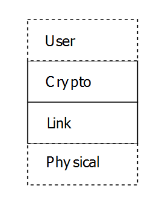

# Introduction

Secure SCADA Protocol (SSP) is cryptographic wrapper designed to secure point-to-multipoint serial protocols, or to act as a security layer for new SCADA applications. It is intended to fill a gap where existing technologies like TLS are not applicable, require too much processing power or bandwidth. It can be used as a protocol agnostic bump in the wire (BitW) at outstation endpoints or as a bump in the stack (BitS) on the master or outstation.

# Requirements

The specification was designed and related protocols selected based on the following requirements.

## Basis of trust - "Utility PKI"

All trust in the system will based on a Public Key Infrastructure (PKI) wholly controlled by the utility. A more efficient certificate format than [x509](https://tools.ietf.org/html/rfc5280) will be utilized by to reduce bandwidth consumption for low bit rate serial networks. Asymmetric key algorithms for key derivation and/or signing will use primitives substantially more efficient than RSA encryption.

## Asymmetric Certificate Revocation

Master certificates (certificates that identify masters to outstations), will use a fast expiration scheme instead of explicit revocation. This works well in an operational environment where the utility has a reliable and isolated IP network between an online authority and multiple master stations. An intermediate authority private key can be used to periodically renew master certificates. Using CRLs with outstations is undesirable as outstation cannot reach them on a serial channel, and masters would have to push revocation notifications down to each endpoint and ensure that they arrive. Outstations would then have to persist these CRLs in non-volatile memory. This scheme requires that outstations have access to an out-of-band time synchronization mechanism such as GPS, local NTP via GPS in a substation, or WWVB. Alternatively, over TCP networks, outstations could check an online CRL.

Outstation certificates (certificates that identify outstations to masters) will be longer lived, and will be revoked using an online CRL accessible to the masters in the system over a traditional TCP network.

## Simplicity of implementation

The encodings, state machines, and other technical details of the protocol shall, above all else without sacrificing security, endeavor to be as simple to implement as possible. Complexity, bells and whistles, and unneeded features inevitably lead to bugs both in specification and implementation. A reference implementation shall be developed to inform the evolving design, and shall not be an afterthought. Too often standardization efforts spend too much time on paper, only to lead to designs that are difficult to implement correctly.

## Use only strong vetted cryptography

SSP21 shall only use algorithms that have received prolonged and intense scrutiny from the crypto community. This does not mean that all algorithms need to be NIST approved. Algorithms that are simpler to implement and/or have variations with provably constant-time implementations should be preferred.

## Extensible only to the extent necessary

* Endpoints shall be able to identify the protocols version to each other during key exchange.
* Must be secure against protocol downgrade attacks (e.g. see Noise handshake).
* The protocol shall use security-suite specifications to allow new algorithms to be used in future versions, or to provide more than one option for when algorithms, inevitably, are compromised.
* The number of initial security suites will be limited to one or two, and will only support authentication initially.

## Authentication

All messages shall be authenticated. Each endpoint in the session shall be able to unambiguously determine that a session message comes from the other endpoint. The authentication mechanism shall automatically provide message integrity and protection from spoofing and MitM attacks. The most likely cryptographic primitive for this authentication will be a MAC like an HMAC or a GMAC. In later iterations where encryption is accommodated, an AEAD cipher mode could be used.

This authentication will ensure that a particular SCADA master is talking to a particular outstation. In other words, it shall only secure the communication link and will not authenticate individual users or operators of the system. Role Based Access Control (RBAC) and auditing of users is best done at the platform level, and is outside the scope of SSP21. Individual SCADA vendors are free to use different technologies such as Active Directory, RSA, LDAP, Kerberos, etc to manage users at the platform level.

Particular BitS implementations could potentially used some metadata in certificates to limit or constrain what is allowed during a particular communication session. How this metadata is used or configured to limit permissions for a particular protocol is outside the scope of SSP21.

## Protection from replay

Both endpoints of the session shall be able to detect replayed session messages. The most common mechanism used to protect against replay is including an increasing nonce (i.e. counter) with each message over which the MAC is calculated. Alternative schemes like challenge-response use a unique random nonce for each session message at the expense of more communication messages.

Although the protocol needs to be secure from replay, it does not need to ensure that all messages are delivered in order, as SCADA protocols like DNP3 automatically handle retries at a higher level.

## Session message “time of validity”

Since SSP21 is designed to protect control protocols with particular timing constraints, undesirable behavior could occur if an attacker held back a series of authenticated control messages and then replayed them in rapid succession. To eliminate this mode of attack, both parties will exchange a relative time-base in milliseconds during the key agreement handshake. Session message shall include a timestamp indicating the last possible relative time value in the more systems time base at which the message should be accepted.

Implementations will have to make these timing parameters configurable so that they can be tuned for the latency and bandwidth of any particular network. As relative clock drift can occur, sessions may need to renegotiated more frequently or the configurable validity window of session messages made larger.

This mode of operation is similar to IEEE 1711-2010, but without the complexity of having multiple units of time. DNP3 (IEEE 1815-2012) Secure Authentication is an example of a protocol with a one pass authentication (aggressive mode) that lacks this protection. Attackers can hold back multiple messages in then replay them in rapid succession within a single session.

## Optional encryption

The secure operation of SCADA system does not require confidentiality of session traffic under all, or even most, circumstances. Reasons to prefer unencrypted sessions include the ability to inspect traffic with IDS/IPS and denying a potentially opaque tunnel usable by an attacker.

Certain systems may exchange sensitive information and require session confidentiality. SSP21 shall use a security suite specification and encodings that allow for encrypted sessions in the future. The session key exchange mechanism shall support forward secrecy.

## Supports bump in the wire retrofits

The outstation implementations of the protocol shall be capable of being deployed as a bump in the wire (BitW) or integrated onto endpoints as a bump in the stack (BitS).  BitS integration is preferred, but it is understood that BitW implementations are necessary to retrofit legacy components during transitions.

Requiring a BitW implementation only for outstations and not masters, simplifies requirements as the BitW needn’t be protocol-aware. It can be configured with the static addresses of the outstation and master, and ignore protocol messages addressed for other nodes. In BitW implementations, all cryptographic operations including key negotiation and authentication will occur at the bump.

## Supports serial and IP

Supporting multi-drop serial means that frames must be addressed in some manner. SSP21 will use 16-bit addressing as this accommodates the addressing scheme used for common existing SCADA protocols. SSP21 will have its own delimiters or length fields, and will use some type of non-cryptographic error detection so that environmental noise is probabilistically filtered out at a level below cryptographic checks for deliberate tampering.

For some protocols, this new secure serial layer could act as a replacement for redundant functionality in existing protocols. For example, the DNP3 link-layer and transport function could be completely removed in BitS implementations and replaced with alternate SSP21 crypto and framing layer. SSP21 could also, fully wrap the existing protocols, but removing redundancy in certain implementations could provide significant bandwidth savings.

Out-of-band messages like session key establishment, heartbeats, etc can only be initiated from the SCADA master side when it attempts to send a normal protocol message. This is because in half-duplex communications the wrapper cannot squelch a reply from a remote by inappropriately using the channel.

## Low overhead

Security is not a zero-cost protocol feature. Inevitably adding a security sub-layer will require more bandwidth, increase latency, and put more computational burden on endpoints. SSP21 will endeavor to minimize these overheads.

* **reduced latency** – BitS implementations have a significant advantage in this regard over BitW. HMAC holdback can double latencies in BitW integrations as the entire packet must be received and verified before the first payload byte can be emitted. Some tricks could be played with asymmetric baud rates to minimize this effect. MAC algorithms should be used for which hardware acceleration exists.

* **reduced bandwidth** – It is not uncommon for serial SCADA systems to operate at rates as low as 1200 BPS. Cryptographic encodings need to be sensitive to tight polling margins. HMACs can be truncated (per NIST guidelines) to reduce overhead. BitS integration may be able to remove redundant layers provided by both the SSP21 and the wrapped protocol. An efficient certificate format that utilizes Elliptic Curve Cryptography (ECC) public keys will be used to reduce certificate sizes.

# Utility PKI

While the primary aim of this specification is describe the protocol in sufficient detail that it can be faithfully implemented, it is important to describe the broader system in which the protocol is designed to operate.

SSP21 is designed to secure the communication link between one or more SCADA masters and some number of field sites as shown in the figure above. It accomplishes this using a PKI wholly owned and controlled by the utility. Ideally, SCADA masters and field assets (RTUs, gateways, IEDs, etc) generate a public / private key pair locally, never share the private key with another entity (human or machine), and can freely disseminate the public key for the purposes of certificate generation. The primary role of any PKI is to reduce the complexity of key management by requiring parties to only place their trust in a central signing authority. To understand the attractiveness of this architecture, it useful to compare it a couple of alternatives.

## Alternative: Symmetric keys only

In this architecture, each communication link has a unique symmetric key that both parties possess prior to any communication occurring. Security is achieved in knowing that only the other end of the channel possesses the same key. In a typical SCADA point-to-multipoint scenario, best practice dictates that there be a unique symmetric key for each outstation (N), and the master would possess a copy of all N keys for the outstations with which it must communicates. The primary advantage of such a system is conceptual simplicity, but the system is difficult to use at scale for several of reasons.

* If multiple masters are needed for redundancy purposes, the keys must be shared with the master increasing the attack surface and the risk of compromise, or the number of keys in the system must be doubled from N to 2N.

* This type of an architecture does a poor job of limiting access to sensitive keys. To commission a new field asset, the key must be entrusted to field personnel, possibly contractors.

* Compromise of a field asset always requires that the channel be rekeyed. Compromise of the master requires that the entire system be rekeyed.

## Alternative: Asymmetric keys without an authority

In this architecture, each communication node has a public / private key pair. It is free to disseminate the public key, and each node must possess the public key for every other node with which it needs to communicate. This architecture better addresses some of the concerns presented with the symmetric key only architecture, namely:

* Multiple masters can be commissioned without doubling the number of keys in the system, however, each outstation must possess the public key of each master with which it must communicate.

* Only the master's public key(s) need to be shared with commissioning personnel. Each outstation can also secure its private key, and only share the public key. This makes tampering from insiders slightly more difficult than in the symmetric only scheme.

A number of potential problems still remain:

* Compromise of a master still results in having to update the master's public key on each outstation.

* Installing or authorizing additional masters requires either sharing the master private key with the backup master, or installing the new master key on all outstations.

## The role of the authority

Small systems with a limited number of outstations may function perfectly well with either the symmetric or asymmetric key scenarios described above. While SSP21 does not support symmetric pre-shared keys, it can operate in an authority-less mode by using what
is commonly referred to as "self signed certificates".

# Protocol Architecture

SSP21 specifies a two layer architecture for delivering secure data to the user layer.

## Link Layer

## Cryptographic Layer (Noise Derivative)

The cryptographic layer is derived with only minor modification from the [Noise Protocol](noiseprotocol.org/). Noise is a self-described framework for building cryptographic protocols. This specification picks from all the available options and modes within Noise to create a subset appropriate for wrapping ICS serial networks. Modifications or clarifications to Noise include:

* Modifying Noise to support authentication only
* Selecting a specific handshake mode that will be used in all applications
* Defining handshake payload data including relative time bases and certificates

# The Link Layer

SSP21's link layer provides three features: framing, addressing, and error-detection. The frame consists of the following fields. All multi-byte integer fields are encoded in big endian for consistency with Noise.

[ **start** ][ **destination** ][ **source** ][ **length** ][ **payload** ... ][ **CRC** ]

The minimum size of a link layer frame is 12 bytes, consisting of the start, length, destination, source, no payload bytes, and the CRC.

**start** (2-bytes) - The start bytes provide a delimiter for the beginning of the frame and shall always begin with the two byte sequence 0x07BB.

**length** (2-bytes) - This length field encodes the number of bytes in the payload. A frame containing no payload will have this field set to zero. An upper maximum size (less than 65535) should be configurable to allow implementations to use less memory when receiving a full frame.

**destination** (2-bytes) - This destination field encodes the address of the intended recipient of the frame. Devices shall always set this field to the address of the intended recipient when transmitting. When receiving a frame, devices shall not do any further processing of frames with an unknown destination address.

**source** (2-bytes) - This source field encodes the address of the transmitting party. The usage of this field may depend on the application layer of wrapped protocol.

**CRC** (4-bytes) - The frame is appended with a four byte CRC value calculated over all preceding bytes. The ethernet CRC32 algorithm is used to calculate this value.
